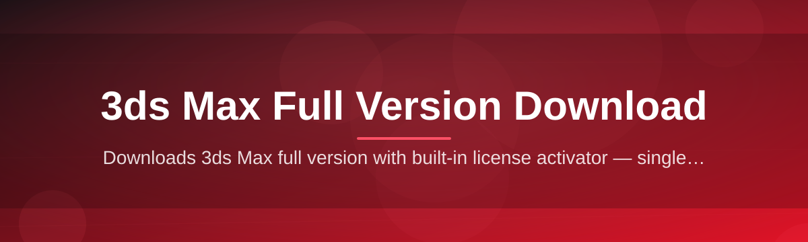

# 3ds-max-install-assistant 🗿⚙️

  

*The quiet assistant that turns a messy 3ds Max full version download into a clean, predictable ritual.*

  

## 🧭 Overview

**What this is NOT**: a mirror, a loader, a shortcut around Autodesk's licensing, or a substitute for an official account. It does not host installers, does not patch binaries, and does not touch activation. If that's what you came for, close the tab.

What it **is**: a lightweight Windows companion that sits between "I need 3ds Max on this machine" and "3ds Max is actually running correctly." The 3ds Max full version download process is deceptively fragile — huge payloads, partial extractions, .NET and VC++ redistributables that silently fail, GPU driver mismatches that only surface after a two-hour wait. This assistant automates the boring, error-prone parts: verifying package integrity, sequencing prerequisite installs, checking system readiness, and giving you a clear pass/fail instead of a cryptic Autodesk error code.

It exists because 3D artists, students, and studio IT admins keep re-learning the same lessons the hard way — wrong install order, missing runtime, insufficient disk headroom, antivirus quarantining legitimate files. This tool encodes that tribal knowledge into a guided, repeatable workflow. Built for freelancers setting up a new rig, classrooms provisioning lab machines, and studios standardizing onboarding across dozens of workstations.

> [!NOTE]
> The assistant orchestrates and verifies your **own, legitimately obtained** 3ds Max installation package. It does not provide the software itself.

---

## 🔍 What It Actually Does

| Capability | Why It Matters |
|---|---|
| **Pre-flight system scan** | Checks CPU, RAM, GPU driver version, and disk headroom before a single byte moves — no more failing at 80%. |
| **Integrity fingerprinting** | Hashes your downloaded package against known-good checksums, catching corrupted or incomplete transfers instantly. |
| **Dependency sequencing** | Installs .NET, VC++ runtimes, and DirectX components in the exact order 3ds Max expects — order matters more than people realize. |
| **Silent-mode orchestration** | Drives the Autodesk installer through unattended mode with sane defaults, so you're not babysitting dialog boxes. |
| **Rollback snapshots** | Captures a lightweight system checkpoint before install, so a bad run can be undone in seconds, not hours. |
| **Live log translation** | Converts Autodesk's cryptic installer logs into plain-English status lines in real time. |
| **Network resilience** | Resumes interrupted transfers instead of restarting the whole 3ds Max full version download from zero. |
| **Post-install validation** | Launches 3ds Max headlessly once, confirms it initializes, and reports a clean bill of health. |

> [!TIP]
> Run the pre-flight scan *before* you even start downloading. It'll flag driver and disk issues that would otherwise waste your bandwidth.

---

## 🚀 Getting Started

1. **Visit the landing page** — the button above is the only place this project distributes builds.
2. **Download the assistant** — a single portable `.exe`, no installer wrapped around the installer.
3. **Run it** — right-click → Run as Administrator (required for dependency checks).
4. **Follow the guided flow** — point it at your 3ds Max package, let it validate, sequence, and confirm.

> [!IMPORTANT]
> Always run as Administrator. Without elevated privileges, dependency detection silently degrades and you'll see false "missing runtime" warnings.

---

## 🖥️ System Requirements

| Component | Minimum |
|---|---|
| OS | Windows 10 (64-bit) or Windows 11 |
| RAM | 8 GB (16 GB recommended for the actual 3ds Max session) |
| Disk | 15 GB free during install, 8 GB steady-state |
| Dependencies | None — fully standalone, self-contained executable |
| Admin rights | Required for the dependency-sequencing stage |

---

## ⚙️ How It Works

The assistant is a thin orchestration layer, not a repackaged installer. It watches, sequences, and verifies — the actual 3ds Max full version download and install remain entirely Autodesk's own binaries.

1. **Scan** — reads hardware, drivers, disk state.
2. **Verify** — checksums the package, flags corruption early.
3. **Sequence** — orders prerequisite runtimes correctly.
4. **Install** — drives the Autodesk installer unattended.
5. **Validate** — launches 3ds Max once, confirms a clean boot.

<strong>Why not just run the Autodesk installer directly?</strong>

You can — this tool exists purely to catch the failure modes the raw installer doesn't explain well: silent dependency conflicts, disk fragmentation issues, and driver mismatches that produce a generic error instead of a useful one.

---

## 🧩 Troubleshooting

**Q: The scan flags my GPU driver as "outdated" but I just updated it.**
A: Some OEM driver packages don't update the version string Windows reports. Force a clean driver reinstall via Device Manager, not the OEM updater.

**Q: My 3ds Max full version download keeps stalling at the same percentage.**
A: That's almost always a proxy or corporate firewall throttling large single-stream transfers. The assistant's resume feature will pick up where it stopped — let it retry.

**Q: Post-install validation fails but 3ds Max seems to open fine manually.**
A: The headless validation check has a stricter timeout. If your machine is slow to cold-boot the app, extend the timeout in Settings → Validation.

**Q: I got a ".NET runtime not found" error despite installing it.**
A: You likely installed the wrong architecture (x86 vs x64). Re-run the dependency sequencer — it targets x64 specifically.

**Q: Antivirus quarantined the assistant on launch.**
A: Unattended installer orchestration trips heuristic scanners. Whitelist the executable's folder; the binary is unsigned-tool-typical, not malicious.

**Q: Rollback snapshot restore didn't remove everything.**
A: Snapshots cover registry and program files, not user-specific 3ds Max preferences under `%APPDATA%`. Clear those manually for a full reset.

---

## 🎨 UI / UX Notes

- **Dark and light themes**, auto-detected from Windows settings.
- **Keyboard-first navigation** — `Tab`/`Shift+Tab` cycles steps, `Enter` confirms, `Esc` cancels a running stage safely.
- **Settings panel** persists your preferred install path, validation timeout, and log verbosity between runs.
- **Live log pane** is collapsible via `Ctrl+L` when you just want the summary, not the noise.

> [!WARNING]
> Closing the window mid-sequence during the "Install" stage can leave a partial dependency state. Use the in-app Cancel button instead — it unwinds safely.

---

## 🤝 Contributing & Community

Issues, workflow refinements, and edge-case reports from real-world 3ds Max full version download attempts are the lifeblood of this project. Open an issue with your system scan log attached — it speeds up triage enormously.

  

> Star the repo if it saved you a re-install. It genuinely helps others find it.

---

## 📜 License

Released under the [MIT License](LICENSE), 2026.

---

## ⚠️ Disclaimer

> [!CAUTION]
> This project is an independent, community-built utility and is **not affiliated with, endorsed by, or sponsored by Autodesk**. "3ds Max" is a trademark of Autodesk, Inc. You are responsible for obtaining a legitimate, properly licensed copy of the software. This tool orchestrates installation steps only — it does not provide, host, or distribute 3ds Max itself.

